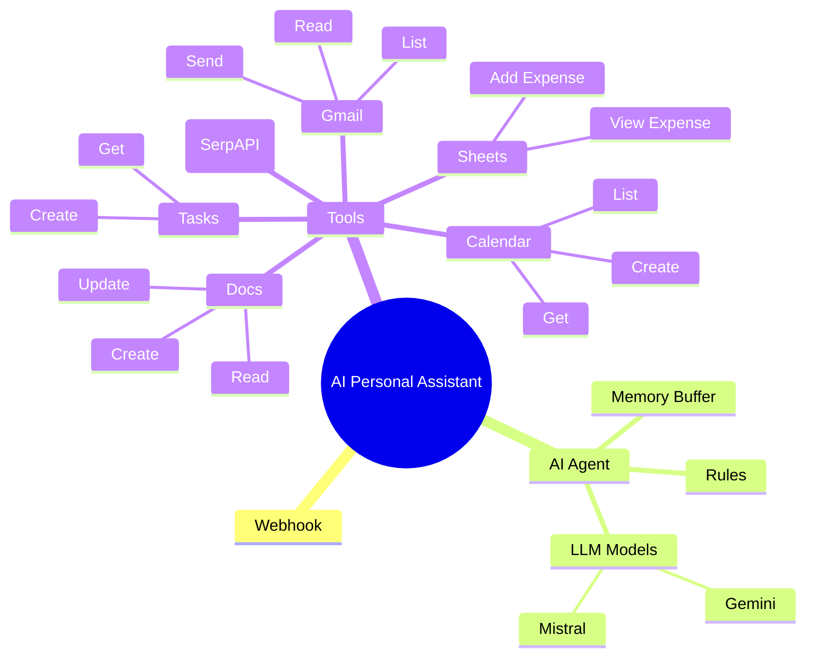

<div align="center">

# 🚀 AI‑Powered Personal AI Assistant Workflow  
### *A Premium, Multi‑Tool Automation Brain Built in n8n*


<br/><br/>

**Smart automation for Calendar, Gmail, Search, Docs, Tasks, and Expense Tracking — all unified into one premium AI workflow.**

</div>

---

## ✨ Executive Summary

This project is a **next‑gen personal AI assistant workflow** crafted in **n8n**.  
It reads human language, routes it to the correct tool, and delivers instant results.  
Think of it as your *automated executive assistant* powered by LLMs + tool chaining.

---

## 🖼 Visual Workflow Preview


---

## 🧠 Architecture Mindmap (Mermaid)



---

## 📊 Infographic (Capabilities Overview)

```
┌─────────────────────────────────────────────────────┐
│                 AI ASSISTANT STACK                  │
├─────────────────────────────────────────────────────┤
│  🧠 AI Agent + Memory Buffer                         │
│  🔎 Web Search (SerpAPI)                            │
│  📅 Calendar (Create/Get/List Events)               │
│  ✉️ Gmail (Read/List/Send)                           │
│  🧾 Expenses (Sheets Append + View)                 │
│  📝 Notes (Docs Create/Read/Update)                 │
│  ✅ Tasks (Create/Get)                               │
└─────────────────────────────────────────────────────┘
```

---

## 🎯 Feature Matrix

| Feature | Status | Description |
|--------|--------|-------------|
| Web Search | ✅ | Live, tool‑forced via SerpAPI |
| Calendar Automation | ✅ | Create / Get / List Events |
| Gmail Automation | ✅ | Read, List, Send |
| Expense Tracking | ✅ | Append & Read Google Sheets |
| Note System | ✅ | Docs Create/Read/Update |
| Task Management | ✅ | Create & Fetch Tasks |
| Multi‑Model Support | ✅ | Gemini + Mistral |
| Memory Context | ✅ | Buffer Window Memory |

---

## 🎞 Slide‑Style Product Deck (Quick Pitch)

**Slide 1 — Problem**  
> Too many tools. Too many manual steps. Too much time wasted.

**Slide 2 — Solution**  
> One AI brain + workflow system that executes everything.

**Slide 3 — Stack**  
> n8n + LLMs + Google Suite + SerpAPI.

**Slide 4 — Result**  
> Instant scheduling, email replies, task creation, expense tracking, and notes.

---

## 🧪 Flashcards (Quick Learning)

**Q:** What triggers the assistant?  
**A:** A webhook request containing a natural language prompt.

**Q:** Can it access live data?  
**A:** Yes. It always uses tools (SerpAPI, Calendar, Gmail, etc.).

**Q:** Does it remember context?  
**A:** Yes. Memory buffer is integrated.

---

## ⚙️ Tech Stack

- **n8n** (Workflow Orchestration)
- **Google Gemini + Mistral** (LLM Models)
- **SerpAPI** (Live Search)
- **Google Calendar / Gmail / Sheets / Docs / Tasks**
- **Memory Buffer Window**

---

## 🧩 Workflow File

- **PERSONAL  AI ASSISTANT WORKFLOW using n8n.json**

---

## 🧾 Sample Commands

```
• Schedule meeting tomorrow at 10 AM
• Send email to HR with subject "Interview Follow‑up"
• Log ₹1500 under Travel expenses
• Create a note titled "Project Roadmap"
• What is USD to INR today?
```

---

## 🔒 Tool‑Use Rules (AI Safety)

✔ Always use tools for real‑time info  
✔ Never answer from memory if tool exists  
✔ Calendar/tool routing enforced at runtime  

---

## 🛠 Setup Guide

1. Import the JSON file in n8n  
2. Add credentials for Google + SerpAPI  
3. Enable the webhook  
4. Test using natural language input  

---

## 🧑‍💻 Author

**Gaurav Singh**  
AI Automation Engineer  
GitHub: [@gaurav-singh-tech](https://github.com/gaurav-singh-tech)

**Contact:**  
📧 Email: gauravbisht2803@gmail.com 
🌐 Portfolio: https://gaurav-singh-tech.github.io/portfolio/#about  
💼 LinkedIn: https://www.linkedin.com/in/contact-gauravsingh/ 

---

## 🌟 Why This is Premium

✅ Modular design  
✅ Multi‑tool reasoning  
✅ Full AI‑tool compliance  
✅ Production‑ready architecture  
✅ Clean visual grouping  

---

## 📌 License

Open for personal and professional automation usage.  
Attribution appreciated.

---

<div align="center">

### ⚡ Built to feel like a real executive assistant — fast, structured, and intelligent.

</div>
